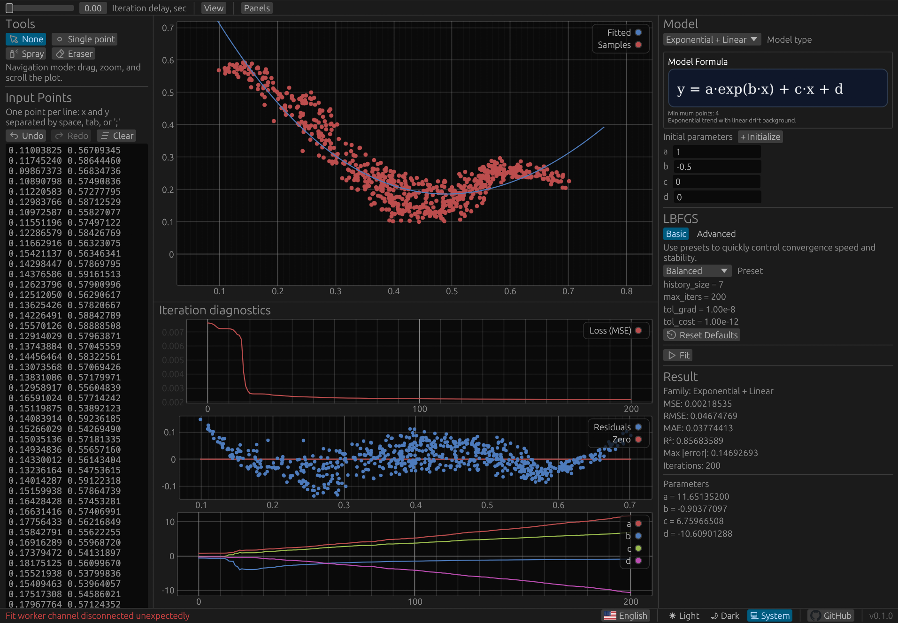

# curve-fit

`curve-fit` — учебное приложение для подбора параметров кривой по набору точек. Основаня цель приложения это наработка интуиции по модельным кривым.

[](https://github.com/hexqnt/curve-fit/actions/workflows/ci.yml)



## Run Desktop

```bash
cargo run
```

## Run Web (wasm)

1. Установить таргет:

```bash
rustup target add wasm32-unknown-unknown
```

2. Установить `trunk` (если не установлен):

```bash
cargo install trunk
```

3. Запустить web-версию:

```bash
trunk serve
```
