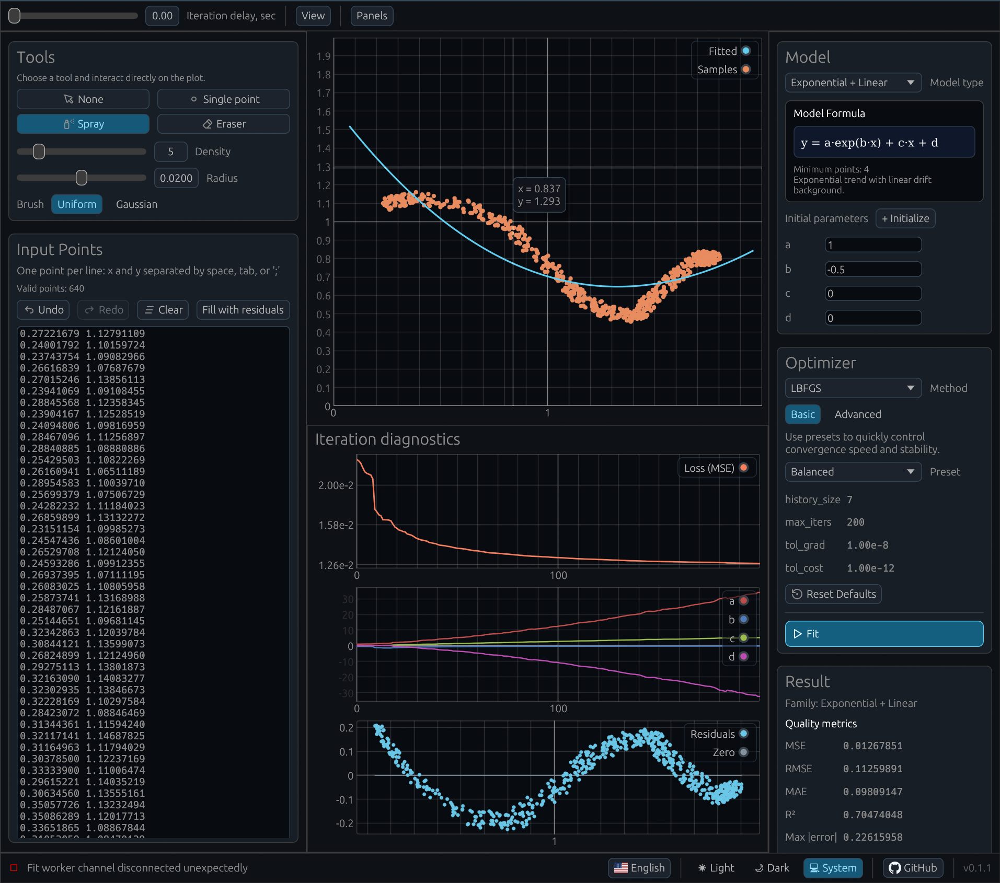

# curve-fit

[English](./README.md) · [Русский](./README.ru.md)

[](https://github.com/hexqnt/curve-fit/actions/workflows/ci.yml)

`curve-fit` — учебное приложение для подбора кривых по реальным или синтетическим данным. Интерактивный интерфейс помогает исследовать, как разные модели, оптимизаторы и функции потерь влияют на результат и процесс сходимости.

Попробуйте [веб-версию](https://curve-fit.hexq.ru) или установите десктопное приложение — оно лучше подходит для работы с большими наборами данных.



## Возможности

- Параметрические модели: полиномиальные, экспоненциальные, сигмоидальные, пиковые, степенные, двухэкспоненциальные и затухающие колебания.
- Линейные сплайны, PCHIP, натуральные кубические сплайны и сплайны Akima.
- Несколько оптимизаторов и функций потерь.
- Интерактивные графики, диагностика итераций, импорт и экспорт данных.

`curve-fit` предназначен для обучения и экспериментов, а не как универсальная production-библиотека для аппроксимации данных.

## Установка готового релиза

Скачайте архив для своей платформы из [последнего релиза на GitHub](https://github.com/hexqnt/curve-fit/releases/latest):

| Платформа              | Окончание имени архива | Исполняемый файл |
| ---------------------- | ---------------------- | ---------------- |
| Linux x86-64           | `linux-x86_64.zip`     | `curve-fit`      |
| macOS на Apple silicon | `macos-aarch64.zip`    | `curve-fit`      |
| Windows x86-64         | `windows-x86_64.zip`   | `curve-fit.exe`  |

Распакуйте архив и запустите исполняемый файл. В Linux или macOS это можно сделать из терминала:

```bash
chmod +x curve-fit
./curve-fit
```

В Windows дважды щёлкните по `curve-fit.exe` или запустите его из PowerShell:

```powershell
.\curve-fit.exe
```

Если macOS блокирует первый запуск, разрешите открытие приложения в разделе **Системные настройки → Конфиденциальность и безопасность**, затем запустите его снова.

## Установка из исходников

Установите [Rust](https://rustup.rs), затем установите и запустите `curve-fit` с помощью nightly toolchain:

```bash
rustup toolchain install nightly
cargo +nightly install --git https://github.com/hexqnt/curve-fit --locked
curve-fit
```

Для сборки в Linux также могут понадобиться пакеты разработки X11, Wayland и OpenGL из вашего дистрибутива.

## Локальный запуск веб-версии

Клонируйте репозиторий, затем выполните:

```bash
rustup target add --toolchain nightly wasm32-unknown-unknown
cargo install trunk --locked
trunk serve --open
```
